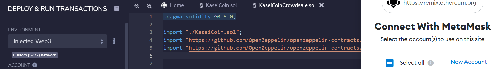
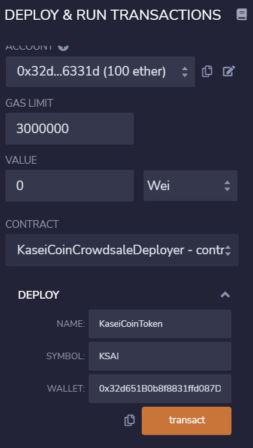
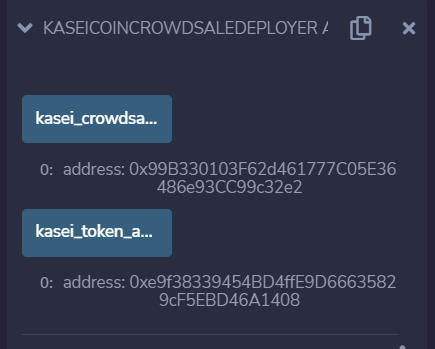
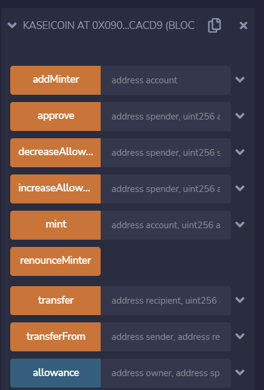

## Martian-Tokens

# Summary
I built a ERC-20 compliant fungible token that will act a currency for an eventual Mars colony. I also built a Crowdsale contract in Solidity in order to enable those moving to Mars to exchange their earthling money for Kasei.

# Technology
This project required Advance Solidity skills. 

Imported libraries from OpenZeppelin into Solidity. 

# Deployment

Connecting to Metamask in order to deploy contracts to my ganache personal (test) chain

Inputting contract variables via constructor & Deploying KaseiCoinCrowdsaleDeployer

Deployed KaseiCoinCrowdsaleDeployer & view of kaseicrowdsale address and kasei token address

Example of loaded KaseiCoin

